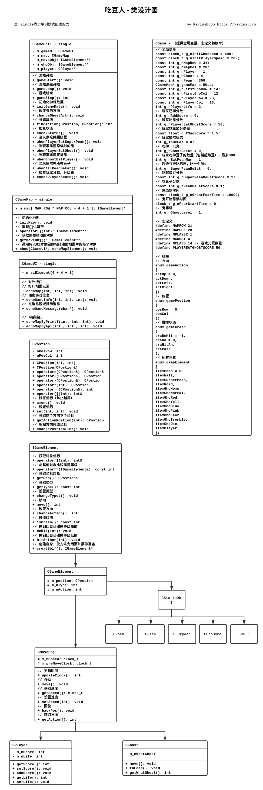

# 吃豆人用户手册

[下载Release版游戏](./Bin/pacMan - 吃豆人.exe)

## 操作方法

- ```空格键``` - 开始/暂停

- ```W``` - 上

- ```S``` - 下

- ```A``` - 左

- ```D``` - 右

## 游戏规则

1. 游戏中的大黄圆点是玩家

2. 玩家有3条生命

1. 游戏中的小点是玩家要吃的豆子

2. 游戏中的大圆空心是能量豆

3. 玩家吃掉一个豆子得1分（包括能量豆）

3. 游戏中的五角星是鬼，鬼会追捕玩家，鬼追到玩家玩家将丧失一条生命

4. 地图中心是鬼的屋子，玩家不能进入

3. 玩家吃完地图上所有的豆子才能获胜（包括能量豆）

4. 玩家吃能量豆之后有10秒的时间可以吃掉鬼，其余时间都是鬼吃掉玩家

5. 玩家吃掉能量豆后，四只鬼会变成黑色，在能量豆消失前两秒，鬼会交替变色

6. 玩家吃掉鬼后，鬼将变成另一种形态且无法吃掉玩家，直到回到鬼屋才会恢复原形

5. 玩家吃鬼的分数是递增的，第一次50分，以后吃掉的每只鬼加上一次1.5倍的分数

6. 一开始鬼的速度是慢于玩家的，玩家每得100分鬼将升一级，升级后鬼的速度会加快，最高4级，速度最快时和玩家相同

7. 玩家和鬼都不能穿墙，鬼可以随时进鬼屋

8. 鬼和鬼是不会碰撞的，也就是他们面对面行走时会穿过对方


## 附：游戏设计 - 类设计图

